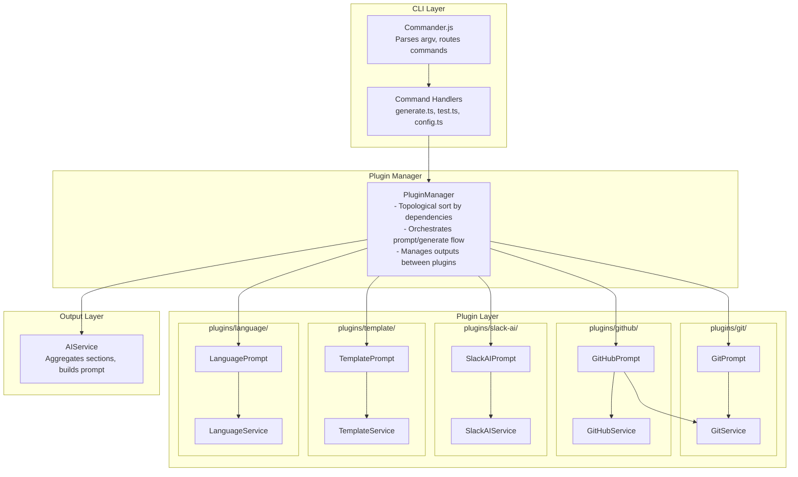
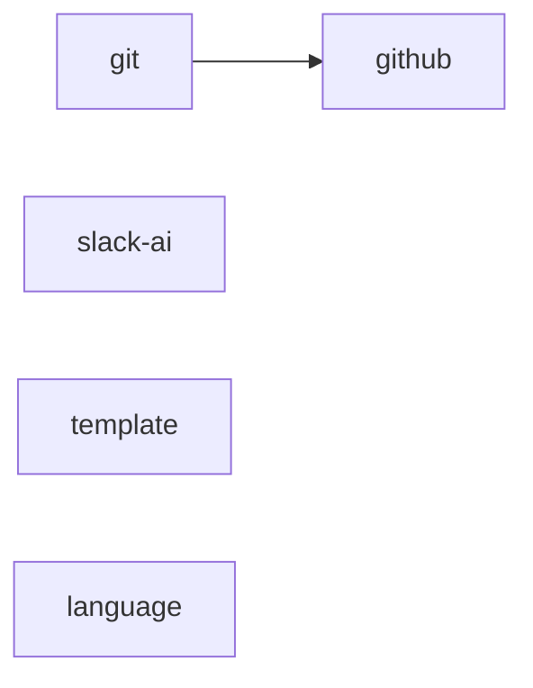
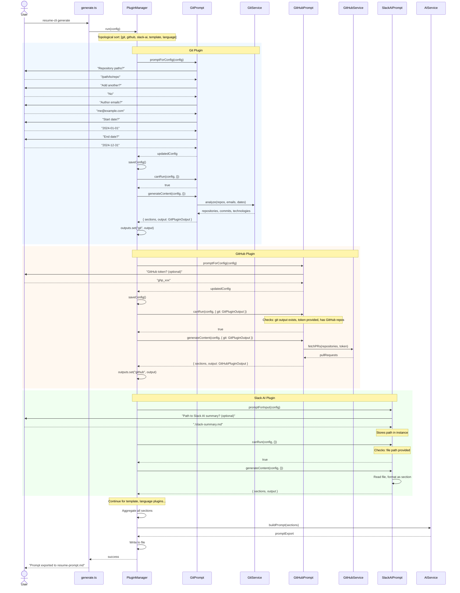
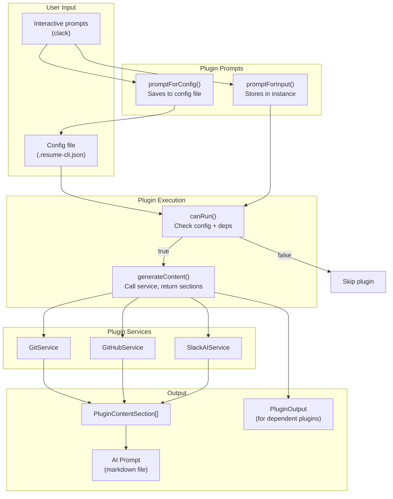

# Developer Notes

Technical decisions and architecture explanations for resume-helper.

## Table of Contents

1. [Plugin Architecture](#plugin-architecture)
2. [Configuration Architecture](#configuration-architecture)
3. [Token Estimation Strategy](#token-estimation-strategy)
4. [PR Body Cleaning with Bun's Markdown Parser](#pr-body-cleaning-with-buns-markdown-parser)
5. [Technology Detection Hierarchy](#technology-detection-hierarchy)
6. [GitHub Enterprise Support](#github-enterprise-support)
7. [Slack Rate Limiting Strategy](#slack-rate-limiting-strategy)
8. [Commit Filtering Logic](#commit-filtering-logic)
9. [Conventional Commit Parsing](#conventional-commit-parsing)
10. [Template Storage Strategy](#template-storage-strategy)
11. [Simplified Output Format](#simplified-output-format)
12. [Language Configuration Flow](#language-configuration-flow)
13. [Slack AI Integration Strategy](#slack-ai-integration-strategy)

---

## Plugin Architecture

### Overview

The CLI uses a plugin-based architecture where each data source (Git, GitHub, Slack AI, etc.) is encapsulated in its own plugin. Each plugin consists of two parts:

- **Prompt** - Handles CLI integration (prompts, user input, validation)
- **Service** - Handles business logic (API calls, data processing)

### Component Diagram



### Plugin Dependencies

Plugins can declare dependencies on other plugins. The PluginManager uses topological sort to ensure plugins run in the correct order.



Currently:

- **github** depends on **git** (needs repository list and commit data)
- **slack-ai**, **template**, **language** have no dependencies

### Sequence Diagram: `resume-cli generate`



### Plugin Interface

```typescript
interface PluginPrompt<TId extends keyof PluginOutputMap> {
  id: TId;
  name: string;

  /** Plugin IDs this plugin depends on */
  needs?: (keyof PluginOutputMap)[];

  /**
   * Prompt for config (saved to file)
   * Called if plugin needs to gather persistent configuration
   */
  promptForConfig(config: ResumeConfig): Promise<ResumeConfig>;

  /**
   * Prompt for runtime input (not saved)
   * e.g., SlackAI asks for file path each time
   */
  promptForInput?(config: ResumeConfig): Promise<void>;

  /**
   * Check if plugin can run
   * Based on config, user input, and dependency outputs
   * Returns false to skip generateContent silently
   */
  canRun(config: ResumeConfig, deps: DepsFor<TId>): boolean;

  /**
   * Generate content
   * @returns sections + output data for dependent plugins
   */
  generateContent(
    config: ResumeConfig,
    deps: DepsFor<TId>,
  ): Promise<PluginResult<TId>>;
}

interface PluginResult<TId extends keyof PluginOutputMap> {
  sections: PluginContentSection[];
  output: PluginOutputMap[TId];
}
```

### Data Flow



### Error Handling

When a plugin fails:

1. Error is logged with clear message (plugin name, step, error)
2. Plugin's output is not stored
3. Dependent plugins will fail `canRun()` check (dep output undefined)
4. Other independent plugins continue to run

---

## Configuration Architecture

### Why JSON file + Interactive Init?

We chose a **local JSON file** (`.resume-cli.json`) with an **interactive init command** for several reasons:

**1. Project-scoped configuration**

```
my-project/
  .resume-cli.json   <- Config lives with the project
  src/
  ...
```

Unlike global config files (`~/.config/resume-cli`), a local JSON file:

- Can be committed to version control (minus secrets)
- Allows different configurations per project/company
- Makes it obvious which settings are in use

**2. Interactive init vs. manual editing**

The `init` command uses [@clack/prompts](https://github.com/bombshell-dev/clack) to guide users through configuration:

```typescript
// src/commands/init.ts
const companyName = await text({
  message: "Company name (for targeted resume):",
  placeholder: "Acme Corp",
  validate: (value) => {
    if (!value) return "Company name is required";
    return undefined;
  },
});
```

Benefits:

- **Validation at input time** - Catches errors immediately (email format, date format, etc.)
- **Discoverability** - Users see all options without reading docs
- **Guided flow** - Complex setup (multiple repos, multiple emails) becomes manageable
- **Defaults** - Sensible defaults can be shown and accepted with Enter

**3. JSON format choice**

We use plain JSON (not YAML, TOML, or env vars) because:

- Native to JavaScript/TypeScript - no parsing libraries needed
- Human-readable and editable for power users
- Easy to programmatically update via `config` command
- Works well with `Bun.file().json()`

**4. Sensitive data handling**

Tokens are stored in the JSON file but:

- The file should be in `.gitignore`
- Environment variables can override (see `.env.example`)
- The CLI masks tokens in output (`••••••••`)

```typescript
// Config structure in src/types/index.ts
export interface ResumeConfig {
  companyName: string;
  startDate: string;
  endDate: string;
  repositories: string[];
  authorEmails: string[];
  githubToken?: string; // Optional, sensitive
  slackToken?: string; // Optional, sensitive
  aiProvider?: "openai" | "anthropic";
  aiApiKey?: string; // Optional, sensitive
  templatePath?: string;
  language?: string;
  maxCommits?: number;
  minimumCommitChanges?: number;
}
```

---

## Token Estimation Strategy

**Location**: `src/services/ai.ts` - `estimateTokenCount()`

### The Problem

Users need to know if their generated prompt will fit within AI model context limits before copying it to ChatGPT/Claude.

### The Solution

```typescript
estimateTokenCount(text: string): number {
  return Math.ceil(text.length / 3.5);
}
```

### Why 3.5 characters per token?

The common rule of thumb is **4 characters per token** for English text. We use **3.5** (more conservative) because:

1. **Non-English text uses more tokens**
   - CJK characters (Chinese, Japanese, Korean) often map to 1-2 tokens per character
   - Accented characters in French, Spanish, German may tokenize differently
   - Since we support `language` configuration, we must account for this

2. **Code and technical content**
   - Variable names, imports, and technical terms tokenize poorly
   - Commit messages often contain paths, hashes, and identifiers

3. **Better to over-estimate than under-estimate**
   - A warning at 50K tokens that's actually 45K is fine
   - Missing a warning at 50K when it's actually 60K causes user frustration

### The 50K Warning Threshold

```typescript
if (estimatedTokens > 50000) {
  console.log(chalk.yellow(`\n Warning: Large prompt detected...`));
}
```

Why 50,000 tokens?

- GPT-4o: 128K context (safe)
- Claude 3: 200K context (safe)
- GPT-3.5-turbo: 16K context (will fail)
- Older models: 4K-8K context (will fail)

50K is a "caution zone" - it works with modern models but suggests the user might want to generate year-by-year for better results.

---

## PR Body Cleaning with Bun's Markdown Parser

**Location**: `src/services/ai.ts` - `cleanPRBody()`

### The Problem

GitHub PR bodies often contain:

- HTML comments (`<!-- template instructions -->`)
- Images and screenshots
- Emoji spam
- Horizontal rules from templates
- Links that add noise without context

### Why Bun's Markdown Parser?

Initially we used regex-based cleaning, but it was fragile and couldn't handle nested structures. Bun has a built-in markdown renderer that accepts custom callbacks:

```typescript
private cleanPRBody(text: string): string {
  // Pre-strip HTML comments (parser doesn't expose these)
  const withoutComments = text.replace(/<!--[\s\S]*?-->/g, "");

  const result = Bun.markdown.render(withoutComments, {
    // Remove images entirely
    image: () => null,
    // Keep link text, discard URL
    link: (children) => children,
    // Remove horizontal rules
    hr: () => null,
    // Remove HTML blocks
    html: () => null,
    // Strip emojis from text
    text: (children) => this.stripEmojis(children),
    // ... preserve structure for other elements
  });

  return result.replace(/\n{3,}/g, "\n\n").trim();
}
```

### Key Design Decisions

1. **Links become plain text**: `[Click here](https://example.com)` becomes `Click here`
   - The URL adds noise; the link text usually carries the meaning

2. **Images are removed entirely**: Screenshots don't help AI understand the PR

3. **HTML comments pre-stripped**: `Bun.markdown.render()` doesn't expose a callback for comments, so we regex them first

4. **Structure preserved**: Headings, lists, and code blocks remain intact - they provide valuable context

### Emoji Stripping

```typescript
private stripEmojis(text: string): string {
  return text
    .replace(/[\u{1F600}-\u{1F64F}...]/gu, "")  // Emoji ranges
    .replace(/\s{2,}/g, " ");  // Collapse spaces left behind
}
```

The regex covers major Unicode emoji ranges. We collapse multiple spaces because removing inline emojis can leave gaps.

---

## Technology Detection Hierarchy

**Location**: `src/services/git.ts` - `detectTechnologies()`

### The Problem

Detecting technologies is tricky:

- README might list technologies the project uses, but the developer didn't touch
- File extensions show what files changed, but not frameworks/tools
- Dependency files are accurate but not always present

### The Three-Tier Approach

```typescript
async detectTechnologies(repoPath: string, commits: GitCommit[]): Promise<TechnologyMention[]> {
  // 1. Analyze README
  const readmeTechs = readme ? this.analyzeReadmeForTechnologies(readme) : [];

  // 2. Detect from file extensions (using linguist-languages)
  const fileTechs = this.detectTechnologiesFromFileChanges(allFiles);

  // 3. Analyze dependency files (package.json, requirements.txt, etc.)
  const depTechs = await this.analyzeDependencyFiles(repoPath);

  // 4. Get infrastructure from file paths (Docker, GitHub Actions, etc.)
  const infrastructureTechs = this.analyzeFilePathsForTechnologies(allFiles);
}
```

### The Intersection Strategy

This is the key insight:

```typescript
if (fileTechs.length > 0) {
  // Intersection: what project uses AND developer touched
  const intersection = readmeTechs.filter((rt) =>
    fileTechs.some((ft) => ft.name === rt.name),
  );

  // If intersection exists, use it; otherwise use file-based only
  baseTechs = intersection.length > 0 ? intersection : fileTechs;
} else {
  // Fallback to README-based if no file techs detected
  baseTechs = readmeTechs;
}
```

**Why intersection instead of union?**

Consider a monorepo with Python backend and React frontend:

- README lists: Python, Django, React, TypeScript, PostgreSQL
- Developer only touched: `.ts` and `.tsx` files

Union would show: Python, Django, React, TypeScript, PostgreSQL (misleading)
Intersection shows: React, TypeScript (accurate)

### linguist-languages Integration

We use GitHub's linguist data for accurate file extension mapping:

```typescript
import * as linguistLanguages from "linguist-languages";

// Build maps at startup
for (const [, lang] of Object.entries(linguistLanguages)) {
  if (lang.type === "programming") {
    // Skip data/markup/prose
    for (const ext of lang.extensions) {
      extensionToLanguageMap.set(ext.slice(1).toLowerCase(), lang.name);
    }
  }
}
```

This handles edge cases like `.tsx` (TypeScript, not JavaScript) and `.h` (C, not C++).

---

## GitHub Enterprise Support

**Location**: `src/services/github.ts`

### The Problem

Many users work on GitHub Enterprise Server (GHE), which has a different API URL structure.

### Auto-Detection from Remote URL

```typescript
static async fromRepository(githubUrl: string, token: string): Promise<GitHubService | null> {
  // Extract host from URL
  const patterns = [
    /https:\/\/([^\/]+)\//,  // HTTPS
    /git@([^:]+):/,          // SSH
  ];

  let host = "github.com";
  for (const pattern of patterns) {
    const match = githubUrl.match(pattern);
    if (match) {
      host = match[1];
      break;
    }
  }

  // Construct API URL
  const enterpriseUrl = host === "github.com"
    ? undefined
    : `https://${host}/api/v3`;

  return new GitHubService(token, enterpriseUrl);
}
```

### Why Classic PATs Are Required

We document this prominently because it's a common gotcha:

```typescript
// In src/commands/init.ts
console.log(
  chalk.yellow("\nImportant: You need a Classic Personal Access Token..."),
);
console.log(
  chalk.dim("Fine-grained PATs are NOT supported on GitHub Enterprise Server."),
);
```

**The technical reason**: GitHub Enterprise Server (as of 2024) doesn't support fine-grained PATs. Users creating tokens on enterprise instances only see the classic token option, but users familiar with github.com might try to use fine-grained tokens and get confused errors.

---

## Slack Rate Limiting Strategy

**Location**: `src/services/slack.ts`

### The Problem

Slack's API has aggressive rate limits, especially for newer apps. The tiers are complex and depend on the endpoint and app age.

### Our Simple Approach

```typescript
private rateLimitDelay = 60000; // 1 minute

private async respectRateLimit(): Promise<void> {
  console.log("  Waiting 60s for rate limit...");
  return new Promise((resolve) => setTimeout(resolve, this.rateLimitDelay));
}
```

### Why 60 Seconds?

We chose a conservative fixed delay instead of adaptive rate limiting because:

1. **Slack's tier system is complex**
   - Tier 1: 1 request/minute
   - Tier 2: 20 requests/minute
   - Tier 3: 50 requests/minute
   - Tier 4: 100 requests/minute
   - Different endpoints have different tiers
   - New apps start at stricter limits

2. **Reliability over speed**
   - Resume generation is a one-time task, not a real-time operation
   - Users can walk away while it runs
   - Better to be slow and succeed than fast and fail

3. **Transparent to users**
   - We warn upfront: "Rate limited to 1 request per minute - this will take time!"
   - Progress is shown: `[3/10] Processing #engineering...`

---

## Commit Filtering Logic

**Location**: `src/services/ai.ts` - `formatRepositoryContext()` and `src/commands/generate.ts`

### Merge Commit Detection

```typescript
private isMergeCommit(message: string): boolean {
  return (
    /^Merge (pull request|branch)/i.test(message) ||
    /^Merge.*into/i.test(message) ||
    (message.includes("#") && /merge|pull/i.test(message))
  );
}
```

**Why filter merge commits?**

- They duplicate information (the PR already captured the work)
- They have no meaningful diff (just combine branches)
- They inflate commit counts misleadingly

### Minimum Changes Threshold

```typescript
const minimumCommitChanges = config.minimumCommitChanges ?? 3;

const filteredCommits = repo.commits
  .filter((c) => !c.isMerge)
  .filter((c) => c.stats.total >= minimumCommitChanges);
```

**Why default to 3 lines?**

- Filters out typo fixes (`fix typo` with 1 line changed)
- Filters out config tweaks (`.gitignore` additions)
- Keeps meaningful work that demonstrates skills

### Shared Limit for Commits and PRs

```typescript
const maxCommits = data.maxCommits ?? 100; // Used for both

// For commits
const displayCommits = filteredCommits.slice(0, maxCommits);

// For PRs
sections.push(this.formatPullRequestsContext(data.pullRequests, maxCommits));
```

**Why share the limit?**

PRs and commits are directly related - a commit belongs to a PR. Having separate limits would be confusing:

- `maxCommits: 50, maxPRs: 100` - You'd see PRs for commits not in the list
- Simpler mental model: "Show me my 100 most significant contributions"

---

## Conventional Commit Parsing

**Location**: `src/services/ai.ts` - `extractCommitDescription()`

### The Problem

Conventional commits like `feat(auth): add OAuth2 support` have useful information buried after the prefix.

### The Solution

```typescript
private extractCommitDescription(message: string): string {
  // Conventional commit: type(scope)?: description
  const conventionalRegex = /^(?:\w+)(?:\([\w\d\/_.\-]+\))?:\s*(.+)/;
  const match = message.match(conventionalRegex);

  if (match && match[1]) {
    return match[1].trim();  // Returns "add OAuth2 support"
  }

  // Non-conventional: truncate at 100 chars
  const maxLength = 100;
  if (message.length > maxLength) {
    return message.slice(0, maxLength - 3).trim() + "...";
  }
  return message;
}
```

### Why Strip the Prefix?

The type/scope prefix is useful for developers but adds noise for resume generation:

- `feat:` is obvious from context
- `auth` scope might not mean anything outside the team
- "Add OAuth2 support" is what matters for a resume

---

## Template Storage Strategy

**Location**: `src/commands/init.ts` - `configureTemplate()`

### The Problem

Users want to provide a resume style example. This could be:

1. A file path to an existing document
2. Text pasted directly during setup

### The `inline:` Prefix Convention

```typescript
if (inputMethod === "paste") {
  const templateText = await text({
    message: "Resume example (paste and press Enter twice):",
    // ...
  });

  // Prefix with "inline:" to distinguish from file paths
  return `inline:${templateText}`;
} else {
  return templatePath; // Just the file path
}
```

When loading:

```typescript
// In src/commands/generate.ts
if (templatePath.startsWith("inline:")) {
  data.templateExample = templatePath.slice(7); // Remove prefix
} else if (existsSync(templatePath)) {
  data.templateExample = await readFile(templatePath, "utf-8");
}
```

### Why This Approach?

1. **Single config field** - No need for separate `templatePath` and `templateText` fields
2. **Backwards compatible** - Old configs with just file paths still work
3. **Clear intent** - The `inline:` prefix makes it obvious what's stored

---

## Simplified Output Format

**Location**: `src/services/ai.ts` - `exportToMarkdown()`

### The Evolution

**Before** (with wrappers):

```markdown
# Generated Resume Prompt

## Data Summary

- Repositories: 3
- Commits: 150
  ...

## Prompt

\`\`\`markdown

# Resume Content Generation Instructions

...
\`\`\`
```

**After** (direct):

```markdown
# Resume Content Generation Instructions

...
```

### Why Remove the Wrappers?

The original format required users to:

1. Open the file
2. Find the code block
3. Copy just the content inside
4. Paste to AI

Now users just:

1. Open the file
2. Select all, copy
3. Paste to AI

The metadata (repo count, commit count) is now shown in the terminal during generation, not in the file.

---

## Language Configuration Flow

**Location**: Multiple files

### The Data Flow

```
init command (src/commands/init.ts)
    |
    v
config.language stored in .resume-cli.json
    |
    v
generate command (src/commands/generate.ts)
    |
    v
promptData.language passed to AIService
    |
    v
buildInstructions() adds language instruction (src/services/ai.ts)
```

### Conditional Instruction

```typescript
private buildInstructions(data: ResumePromptData): string {
  const languageInstruction =
    data.language && data.language.toLowerCase() !== "english"
      ? `\n## Language\n\nThe source content is in **${data.language}**. Generate all resume content in **${data.language}**.\n`
      : "";

  return `# Resume Content Generation Instructions
...
${languageInstruction}
## Your Task
...`;
}
```

### Why Only for Non-English?

1. **Reduces prompt noise** - English is the default; no need to state it
2. **AI models default to English** - Adding "write in English" is redundant
3. **Saves tokens** - Small optimization, but why not?

The instruction explicitly tells the AI that both the source data AND output should be in the specified language. This prevents the AI from translating French commits into English resume bullet points.

---

## Slack AI Integration Strategy

**Location**: `src/commands/slack-prompt.ts`, `src/services/ai.ts`

### The Problem

Slack's API requires publishing an app to their marketplace and getting admin authorization on workspaces. This conflicts with the tool's goal of being non-intrusive and transparent. Additionally, excessive API usage can trigger warning notifications to workspace admins.

### The Alternative: Slack AI as a Proxy

Instead of using Slack's API directly, we leverage Slack's built-in AI feature to extract and summarize professional contributions. This approach:

1. **Requires no API token** - Users interact with Slack AI through the normal Slack interface
2. **Non-intrusive** - No app installation or admin approval needed
3. **Privacy-aware** - Slack AI already has access to the data; we're just getting a summary
4. **Token-efficient** - Slack AI condenses months of messages into a digestible summary

### Why Summarize with Slack AI Instead of Raw Extraction?

We considered two approaches:

**Option A: Raw message extraction** (rejected)

- Extract raw messages and process them ourselves
- Problems:
  - Without API, manual copy-paste of raw messages is impractical
  - A year of Slack messages could be 100K+ tokens
  - Raw messages include noise ("ok", "thanks", "lol")

**Option B: Slack AI summarization** (chosen)

- Let Slack AI summarize, then pass to final LLM
- Benefits:
  - Slack AI does the heavy lifting of condensing data
  - Output is typically 2-3K tokens, fitting well alongside git/PR data
  - Slack AI understands channel context and thread relationships
  - "Double LLM" concern is minimal since we're extracting factual information, not creative writing

### The Workflow

```
┌─────────────────┐     ┌──────────────┐     ┌─────────────────┐
│  slack-prompt   │────▶│   Slack AI   │────▶│  slack-context  │
│    command      │     │  (in Slack)  │     │    .txt file    │
└─────────────────┘     └──────────────┘     └────────┬────────┘
                                                      │
┌─────────────────┐                                   │
│    generate     │◀──────────────────────────────────┘
│    command      │     --slack-context flag
└─────────────────┘
```

1. User runs `slack-prompt` to get a template prompt
2. User pastes prompt into Slack AI conversation
3. User copies Slack AI response to a file
4. User passes file to `generate --slack-context <file>`

### Prompt Design

The Slack AI prompt is structured to extract five categories of information:

```typescript
const categories = [
  "Project Discussions & Technical Decisions",
  "Cross-Team Collaboration",
  "Leadership & Mentoring",
  "Initiative Ownership",
  "Impact & Results",
];
```

Each category includes specific guidance on what to look for (e.g., "Architecture decisions I drove", "Helping teammates with questions"). This structured approach helps Slack AI focus on resume-relevant content.

### Integration with Final Prompt

The Slack AI context is added to the final prompt as a separate section:

```typescript
if (data.slackAiContext) {
  sections.push("\n## Collaboration Insights (from Slack AI)\n");
  sections.push(
    "The following is a pre-summarized analysis of Slack conversations:\n",
  );
  sections.push(data.slackAiContext);
}
```

The AI instructions are also updated to reference this data:

> "If Slack AI insights are provided, use them to enrich achievements with collaboration stories, cross-team work, and soft skills that code doesn't show"

### Future Improvement: Parallel UX

Currently, the workflow is sequential: run `slack-prompt`, query Slack AI, save response, then run `generate`. A better UX would be:

```
┌─────────────────────────────────────────────────────────────┐
│                     generate command                        │
├─────────────────────────────────────────────────────────────┤
│  1. Display Slack AI prompt to user                         │
│  2. Start fetching git commits and GitHub PRs in parallel   │
│  3. Wait for user to paste Slack AI response                │
│  4. Combine all data and generate final prompt              │
└─────────────────────────────────────────────────────────────┘
```

This would allow the user to query Slack AI while git/GitHub data is being fetched in the background, reducing total wait time. Implementation would require:

- Interactive prompt during `generate` command
- Parallel data fetching with Promise.all or similar
- State management to track what's ready vs. waiting for user input

This enhancement is tracked for future implementation.
